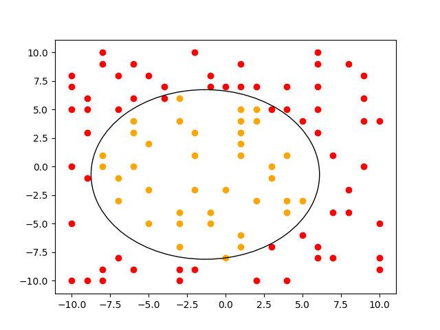
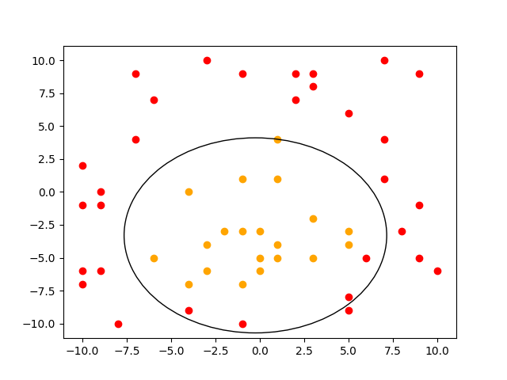
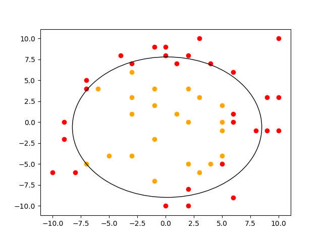

# Find-S  algorithm

 - This code is the implementation of Find-S algorithm to segregate positive and negative examples in the given data.
- The implementation is basic and the dataset is generated at random.
- The postive region is iteratively computed in the form of circles with increasing radius.
- The postive examples are governed by the equation : 
>                    X^2 + Y^2 + 2X + 3Y <= 49
# Output
- The  following images provide the brief overview of the implementation.
- The red data points are negative and the orange ones are positive.

- 
-  
- 
